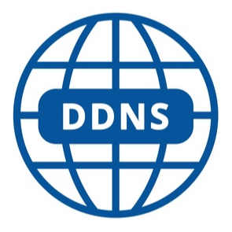
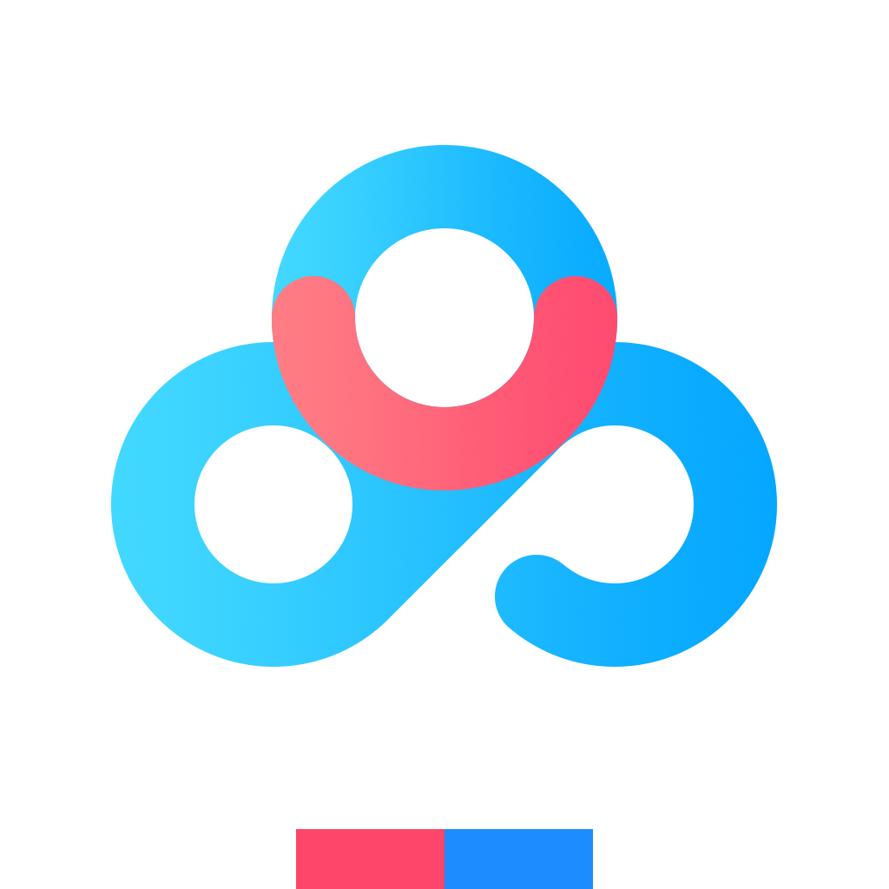
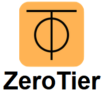

下载地址：链接：https://pan.baidu.com/s/1ccJjNM9rYW5Dmsjj8-0I6A?pwd=khv4 
提取码：khv4 

| 应用图标                                                     | 名称                | 版本号  | 简介                                                         | 更新日期      |
| ------------------------------------------------------------ | ------------------- | ------- | :----------------------------------------------------------- | ------------- |
|  | audiobookshelf      | 2.16.2  | 一款管理博客和有声书的自托管系统。                           | 2024年11月6日 |
|  | bililive-go         | 0.7.33  | Bililive-go是一个支持多种直播平台的 直播录制工具,支持B站、抖音、斗鱼、 虎牙、快手等等平台。 | 2024年11月6日 |
|  | calibre-web         | 0.6.23  | Calibre-Web用于浏览、阅读和下载  Calibre 数据库中存储的电子书。 | 2024年11月6日 |
|  | cloudreve           | 3.8.3   | Cloudreve是一个功能强大、易于使 用的云盘系统，适用于个人或组织进 行文件管理和分享。 | 2024年11月6日 |
|   | ddns-go             | 6.7.3   | 自动获得你的公网 IPv4 或 IPv6  地址，并解析到对应的域名服务。 | 2024年11月6日 |
|     | emby                | 4.8.10  | 大家可以通过这款软件来实现流媒 体内容的播放。使得用户们在任意的 地方都可以来快捷的观看，为你打造 了一个私人的影视播放器服务平台。 | 2024年11月6日 |
|  | filedrop            | 1.0.6   | filedrop 是一个简单而有效的开源 文件分享工具。          | 2024年11月6日 |
|    | gitea               | 1.22.3  | Gitea是一个开源的自托管 Git 服务， 类似于 GitHub、GitLab 等平台。 | 2024年11月6日 |
|       | halo                | 2.20    | Halo是一个开源的博客系统。                                   | 2024年11月6日 |
|  | homebox             | 0.10.3  | Homebox 是一个为家庭用户打造 的库存和组织系统。         | 2024年11月6日 |
|  | homepage            | 0.7.1   | homepage是一款方便实用的NAS 导航页面和主页。            | 2024年11月6日 |
|    | huntly              | 0.3.9   | 一款超强大的自托管信息管理工具， 支持管理RSS、自动保存网页、 稍后阅读... | 2024年11月6日 |
|  | jellyfin            | 10.10.0 | Jellyfin 是一个自由的软件媒体系统， 用于控制和管理媒体和流媒体。 | 2024年11月6日 |
|  | kkfileview          | 4.4.0   | 文件文档在线预览解决方案。                                   | 2024年11月6日 |
|    | lomorage            | 1.0     | Lomorage是一套私有照片云解决方案， 您可以搭建自己的私有云服务，管理照片视频， 并能方便的从多台设备进行备份和访问， 包含WEB、苹果、安卓三大客户端。 | 2024年11月6日 |
|     | lskyPro             | 2.1     | 兰空图床一个用于在线上传、管理图片的图床程序。               | 2024年11月6日 |
|    | memos               | 0.22.5  | 一个开源的个人知识管理系统。它支持 Markdown编辑、版本控制，是安全可靠 的个人知识管理工具，适用于个人和团队协作。 | 2024年11月6日 |
|  | nginx-proxy-manager | 2.12.1  | 一个基于 Web 的Nginx 服务器管理工具。                        | 2024年11月6日 |
|  | portainer           | 2.21.4  | ortainer是Docker的图形化管理WEB工具。                        | 2024年11月6日 |
|  | qbittorrent         | 4.5.5   | qBittorrent 是一款种子下载工具。                             | 2024年11月6日 |
|  | qinglong            | 2.17.12 | 青龙面板是一个管理和运行自动化脚本的工具。                   | 2024年11月6日 |
|  | reference           | 1.45.0  | 开发人员查阅技术栈速查表。                                   | 2024年11月6日 |
|    | samwaf              | 1.3.7   | 一款开源轻量级的网站应用防火墙。                             | 2024年11月6日 |
|   | showdoc             | 3.3.0   | 一个非常适合IT团队的在线API文档、 技术文档工具。你可以方便地使用 markdown  语法来书写出美观的 API 文档、数据字典文档、 技术文档、在线 excel 文档等等。 | 2024年11月6日 |
|    | traggo              | 0.5.1   | Traggo 是一个基于标签的时间跟踪工具。                        | 2024年11月6日 |
|  | transmission        | 3.0     | Transmission是一种BitTorrent客户端, 特点是一个跨平台的后端和其上的简洁 的用户界面。 | 2024年11月6日 |
|  | vocechat            | 0.3.55  | vocechat是一款支持独立部署的轻量级、 跨平台及时聊天工具,开源且完全免费,数 据完全由用户自己掌握。它提供私有频道、 公共频道和私聊功能 | 2024年11月6日 |
|   | wallos              | 2.34.0  | 针对周期财务、账单进行管理的财务管理 系统，支持如自动续费、代扣、过期管理、 纪念日等。 | 2024年11月6日 |
|  | yesPlayMusic        | 0.4.8   | 高颜值的第三方网易云播放器。                                 | 2024年11月6日 |
|     | zentao              | 20.8    | 禅道是国产的开源免费项目管理软件。 它的核心管理思想基于敏捷方法scrum ，内置了产品管理和项目管理，同时又 根据国内研发现状补充了测试管理、 计划管理、发布管理、文档管理、 事务管理等功能。 | 2024年11月6日 |
|    | alist               | 3.33.0  | AList 是一个支持多种存储,支持网 页浏览和 WebDAV的文件列表程序， 支持包括本地存储、百度网盘、 阿里云盘、OneDrive、Google Drive 等40个网络云盘和存储服务商。 | 2024年11月6日 |
|  | baidunetdisk        | 1.0     | 百度网盘是一款国民级产品,提供稳定、 安全的个人云存储服务,已实现电脑、 手机、电视等多种终端场景的覆盖和 互联,并支持多类型文件的备份、分享、 查看、下载功能。 | 2024年11月6日 |
|  | dockermanager       | 1.0     | dockermanager通过可视化的界面， 让即使不熟悉docker命令的用户 也可以非常方便的进行Docker管理和维护。 | 2024年11月6日 |
|   | duplicati           | 1.0     | Duplicati 是一款开源的数据备份工具。 可将加密的、增量的、压缩的备份安全 地存储在云存储服务和远程文件服务器上。 | 2024年11月6日 |
|  | filebrowser         | 1.0     | filebrowser是一款页面友好的网页版文件 管理器。          | 2024年11月6日 |
|     | gitness             | 1.0     | Gitness是一个代码托管和持续集成服务。                        | 2024年11月6日 |
|      | gopeed              | 1.0     | gopeed开源、轻量、原生，支持（HTTP、 BitTorrent、Magnet等）协议下载，并且 支持全平台使用，速度非常快，界面美观。 | 2024年11月6日 |
|         | odoo                | 17      | odoo是一个开源的企业 ERP 系统。                              | 2024年11月6日 |
|   | onenav              | 0.9.34  | onenav是一款导航/书签管理器。                                | 2024年11月6日 |
|  | photoprism          | 1.0     | photoPrism是一款功能强大的AI照 片管理工具。             | 2024年11月6日 |
|    | sftpgo              | 2.5.6   | SFTPGo功能齐全、高度可配置化、 支持自定义 HTTP/S，FTP/S 和 WebDAV  的 SFTP 服务。 | 2024年11月6日 |
|   | syncthing           | 1.0     | Syncthing是一个开源文件同步工具， 可以在多台设备之间实时同步文件或文件夹。 | 2024年11月6日 |
|  | tailscale           | 1.62.0  | Tailscale是一款异地组网,内网穿透工具。                       | 2024年11月6日 |
|    | zerotier            | 1.2     | ZeroTier是一款异地组网,内网穿透工具。                        | 2024年11月6日 |

